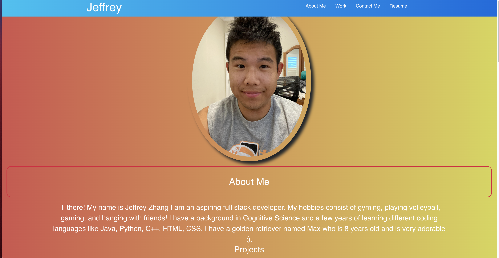

# Twilights-React-Portfolio

[](#license)

An React application portfolio that showcases projects and includes contact information. It was built using Node.js, JS, and React.

## Description 
This project was put together to create a space in which I could showcase my work in the CS field and let potential employers have a way to reach out to me. It will definitely be updated in the future in both visual and functionality aspects to improve the site. 
## Technologies Used

- Node.js
- JavaScript
- React

## Table of Contents

* [Installation](#installation)
* [Usage](#usage)
* [Credits](#credits)
* [License](#license)
* [Contributing](#contributing)

## Installation
  - Upload all files or fork this repository to a server with a Node.js runtime environment
  - To host locally, run `npm -i` from the root directory to install dependencies for this app. 
  - Run `npm start` to start the development server.
  - Run `npm build` to construct a production version

## Usage 
Run `npm start` to start the server.

## Deployed Link

[https://jeffz98.github.io/Twilights-React-Portfolio/](https://jeffz98.github.io/Twilights-React-Portfolio/)

## Screenshots



## Credits
This application was built with the support of the resources and staff of the UCB Full Stack Full Time Coding Bootcamp Summer 2022. 

-W3 Schools


## License

```
MIT License
```

</details>

## Contributing
This project isn't currently acccepting contributions.

## Questions
- View my Github [profile](https://github.com/jeffz98)
- Contact me at my [email](mailto:jeffz98@berkeley.edu)